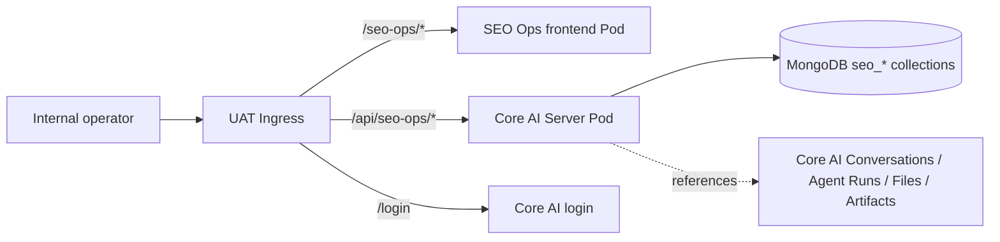
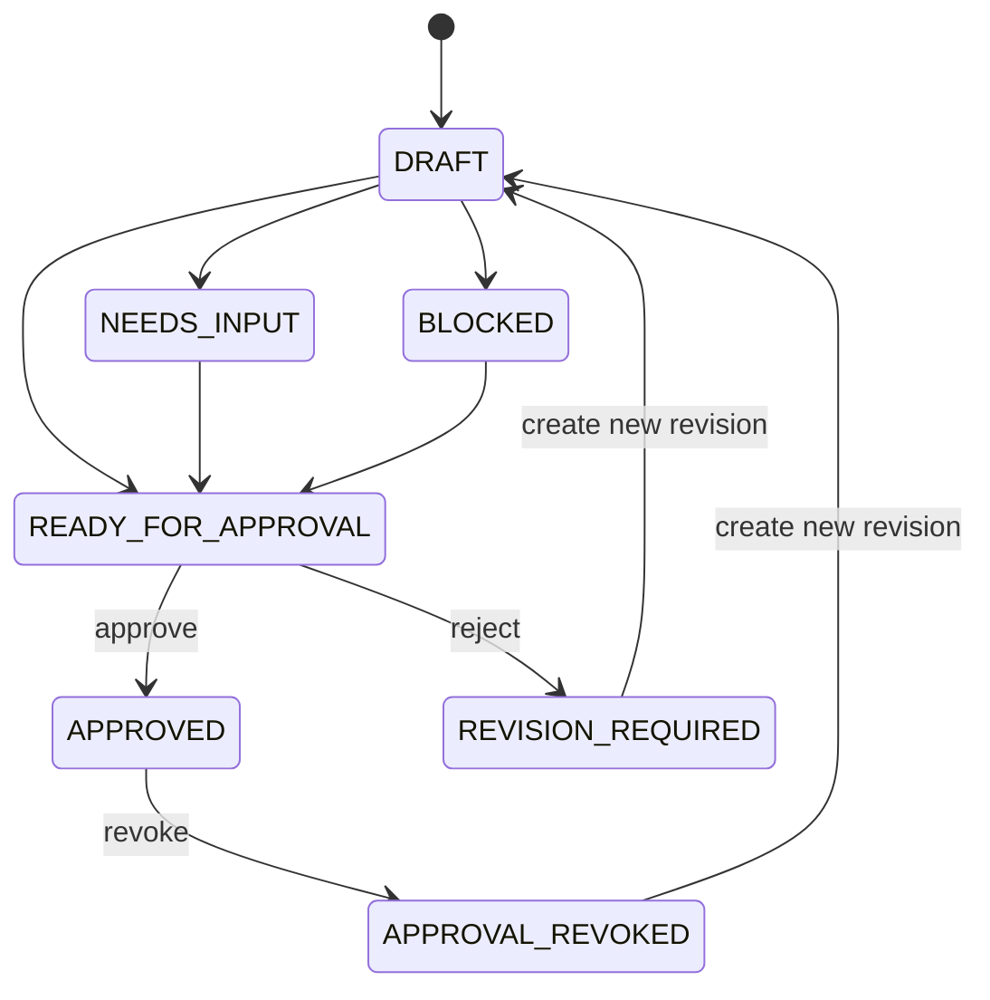
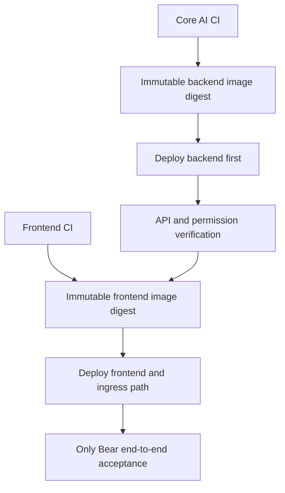

# SEO Operations Control Plane + Core AI UAT Design

- **Date:** 2026-08-17
- **Status:** Product and architecture decisions approved interactively; written review pending
- **Primary repository:** `connexup-seo-ops`
- **Backend repository:** `core-ai`
- **Target environment:** UAT only (`uat-ai`); Production is out of scope

## 1. Executive Summary

Connexup SEO Operations is an internal operating system for a managed-service team whose operators may each serve dozens of merchants. It is not a merchant-facing portal and it is not a generic analytics dashboard. Its primary job is to turn evidence, plans, approvals, execution attempts, verification, review, and reporting into one auditable operating loop.

The first release is intentionally a control plane. It persists merchants, locations, SEO tasks, evidence, and approval decisions in Core AI, and it can link to existing Core AI conversations, agent runs, files, and artifacts. It does not dispatch an execution agent when a task is approved, and it does not mutate Google Business Profile, websites, POS systems, or any other external system.

The first real vertical slice is:

`Only Bear → create task → add evidence → generate approval preview → approve → independently read back`

UWS and Keke remain explicit blocked or identity-incomplete cases. The product must show why they are blocked rather than silently degrading to mock data or pretending that execution is ready.

The UAT topology uses a separate `connexup-seo-ops` frontend Pod under `/seo-ops`, while the backend is a native `seoops` bounded context inside `core-ai-server` under `/api/seo-ops`. Both are served on the existing UAT origin and reuse Core AI authentication and authorization.

## 2. Business Context

Connexup operates SEO on behalf of merchants. Internal staff therefore need to manage many merchants, locations, deadlines, evidence sources, risks, approvals, agent activity, and outcomes without losing context or accidentally applying one merchant's action to another.

The system must optimize for:

- operator throughput across dozens of merchants;
- explicit merchant and location context;
- evidence-led decisions;
- traceable human approval;
- separation of business tasks from technical agent runs;
- safe handoff from analysis to eventual execution;
- operational review, reporting, and causal readiness;
- durable internal auditability.

The main failure modes to prevent are:

- merchant buttons or cards becoming visually unmanageable at scale;
- tasks being buried inside individual merchant pages;
- chat or agents acting outside the current merchant context;
- an approval being applied to a stale task definition;
- an agent run being mistaken for a completed business outcome;
- a correlation being presented as a causal conclusion;
- a UAT fixture being mistaken for persisted business data;
- an approval silently triggering an external write.

## 3. Goals and Non-goals

### 3.1 MVP goals

- Provide a portfolio-level view across all assigned merchants.
- Provide a dense, filterable action inbox for daily execution work.
- Persist Merchant, Location, SeoTask, EvidenceRef, ApprovalDecision, and TaskEvent data.
- Keep task definition revisions separate from workflow state changes.
- Generate deterministic approval previews and reject stale approvals.
- Link, but not duplicate, Core AI conversation, Agent Run, File, and Artifact records.
- Add a contextual SEO Copilot interface with strict read/propose boundaries.
- Surface reviews, reports, and causal-readiness analysis in the main information architecture.
- Deploy the frontend and backend independently to UAT with observable, reversible releases.
- Prove the real persisted approval path and prove the absence of external execution.

### 3.2 MVP non-goals

- Merchant-facing login or self-service workflows.
- Automated Agent dispatch after approval.
- GBP, website, POS, ad platform, or CMS mutation.
- Full merchant onboarding UI.
- Recurring-task scheduler execution; a recurring occurrence is modeled as an independent task when materialized.
- Bulk approval.
- Reusing Core AI's existing background-maintenance `/tasks` API.
- Copying chat transcripts or large evidence payloads into `seo_tasks`.
- Claiming causal impact from before/after correlation alone.
- Production deployment.

## 4. Users, Roles, and Permissions

The product supports internal staff only. A person may hold multiple permissions.

| Capability | Permission | Typical user |
| --- | --- | --- |
| View portfolio, tasks, evidence, approvals, reports | `seoops.view` | Operator, analyst, manager |
| Create/revise tasks and append evidence | `seoops.manage` | Operator, SEO specialist |
| Generate approval preview and approve/reject/revoke | `seoops.approve` | Reviewer, team lead |

Core AI remains the authority for authentication, role configuration, and permission evaluation. The frontend may hide or disable controls for usability, but the backend always enforces permissions.

Role definitions that grant `seoops.manage` or `seoops.approve` also grant `seoops.view`; write or approval capability is never useful without visibility into the affected task and evidence.

An invisible or inaccessible entity returns `404` where revealing its existence would leak cross-merchant information. An authenticated user who can see the entity but lacks the attempted capability receives `403`.

## 5. Product Principles

1. **Portfolio first.** The default operating context is the assigned portfolio, not a single merchant homepage.
2. **Queue before cards.** High-volume work is represented as a dense, sortable work queue.
3. **Context is always visible.** Merchant, location, and task context never disappear when the operator opens chat, evidence, or approval.
4. **Evidence before decision.** Readiness and approval are derived from required evidence rather than from optimistic UI state.
5. **Approval authorizes; it does not execute.** MVP approval is a durable human decision only.
6. **Server readback defines success.** A client-side animation or successful request alone is not completion.
7. **Facts, correlation, and causality are different products.** Each receives a distinct label and evidence threshold.
8. **Fail closed.** Missing identity, stale versions, missing evidence, or ambiguous external state blocks progression.

## 6. Information Architecture

The primary navigation contains business modules, not a merchant list:

1. Merchant Portfolio
2. Action Inbox
3. Execution Tasks
4. Reviews & Causal Analysis
5. Data & Reports
6. System Administration

SEO Copilot is a contextual right-side panel available from the portfolio, merchant, and task surfaces. It is not a separate top-level destination.

Recommended routes:

| Route | Purpose |
| --- | --- |
| `/seo-ops` | Portfolio overview |
| `/seo-ops/inbox` | Cross-merchant action queue |
| `/seo-ops/merchants/:merchantId` | Merchant workspace |
| `/seo-ops/tasks/:taskId` | Durable task deep link |
| `/seo-ops/reviews` | Review and causal-readiness workspace |
| `/seo-ops/reports` | Internal dashboards and report library |

### 6.1 Merchant selection at scale

Merchant names are not rendered as a row of permanent buttons. The header contains one global merchant switcher with:

- type-ahead search;
- recently opened merchants;
- favorites;
- assignee/owner filtering;
- risk and blocked-state indicators;
- explicit “All assigned merchants” portfolio mode.

When a merchant is selected, its identity remains pinned in the header. Location selection is nested under the merchant and must never change merchant implicitly.

### 6.2 Action inbox

The default view is a server-paginated, filterable table rather than a card grid. The baseline columns are:

- merchant and location;
- task title and type;
- priority and impact;
- workflow status;
- evidence state;
- assignee;
- due date/SLA;
- approval status;
- latest update.

Saved views include at least:

- My work today;
- Needs judgement;
- Waiting for merchant input;
- Blocked;
- Ready for approval;
- Overdue/high risk;
- Recently approved.

Safe bulk actions such as assignment and priority changes may be introduced after the first vertical slice. Bulk approval is prohibited in MVP.

### 6.3 Task workspace

A task opens as a durable page; a drawer may be used for quick inspection from the inbox. The workspace contains:

- current task definition and revision;
- status and state version;
- checklist and requirements;
- evidence rail;
- approval preview and decision history;
- linked conversations and Agent Runs;
- append-only event timeline;
- review and causal-analysis entry;
- contextual SEO Copilot.

Every task has a copyable deep link. Switching pages must not silently change the active merchant context.

## 7. Dashboards, Analysis, and Reports

### 7.1 Portfolio dashboard

The portfolio dashboard is operational. It answers:

- What needs attention now?
- Which merchants are blocked or overdue?
- Where is evidence incomplete?
- Which tasks are ready for approval?
- Which operator or merchant is accumulating SLA risk?

Metrics are computed from persisted task state and evidence state. They are not inferred from local fixture data.

### 7.2 Merchant analytics

Merchant analytics combines business measurements with the task/event timeline. A chart must expose its source, scope, capture time, and freshness. Missing measurements render as missing rather than as zero.

### 7.3 Report library

Reports are stored as or linked to Core AI Files/Artifacts. The SEO task contains only the reference, checksum, capture metadata, and relationship to the task. The report library supports merchant, location, report type, time range, and freshness filters.

### 7.4 Review and causal analysis

The review template is:

`Goal → Baseline → Intervention/Action → Observed Change → Competing Explanations → Conclusion Strength → Follow-up Test`

The UI distinguishes:

- **Factual review:** what was done, when, by whom, using which evidence;
- **Correlation analysis:** whether measurements moved around the same time;
- **Causal analysis:** whether a defensible design supports an effect estimate.

MVP can show factual review, correlation, and a causal-readiness assessment. It must display “insufficient evidence to determine causality” when inputs or design are inadequate.

Future causal computation uses separate domain records such as `Intervention`, `AnalysisInputSnapshot`, `CausalAnalysisRun`, and `CausalEstimate`. These records must freeze selected measurements, queries, captured values, timestamps, checksums, and code/model versions. They must not be collapsed into a free-text TaskEvent.

## 8. SEO Copilot and Chat Boundary

SEO Copilot has three explicit scopes:

- **Portfolio:** compare merchants, identify anomalies, summarize workload;
- **Merchant:** summarize history, locate evidence, propose task drafts;
- **Task:** explain requirements, identify missing evidence, produce an approval preview, assist review.

The current scope is shown as visible chips in the panel header. A chat turn may never silently retain one merchant's data after the user switches to another merchant.

The chat interface reuses Core AI's existing conversation and Agent Run infrastructure. A conversation may create an analysis-only Agent Run, but it must not dispatch an execution Agent or invoke an external mutation. In MVP, SEO Copilot receives only read-only SEO Ops tools. It may return a structured task draft or a review-readiness explanation, but the operator must commit a draft through the normal SEO Ops API. A formal approval preview remains an explicit UI/API action guarded by `seoops.approve`; chat cannot manufacture or submit it.

Chat requirements:

- answers identify evidence sources and their capture times;
- uncertainty and missing inputs are explicit;
- cross-merchant retrieval is limited to the user's visible portfolio;
- manage and approval APIs are not registered as autonomous chat tools in MVP;
- a formal approval preview uses `/tasks/:id/approval-previews` and the current user's permission;
- an approval cannot be completed inside a free-text chat response;
- approval never triggers an execution Agent;
- task records store only Core AI `conversation_id` and `agent_run_id` links;
- chat transcripts remain in the existing Core AI conversation store;
- large outputs remain Core AI File/Artifact records.

When a draft is committed from chat, the task create/revision command includes the originating `conversation_id`. Core AI appends the conversation/run link through the domain service; no separate SEO-specific chat persistence API is required.

## 9. System Architecture

### 9.1 Frontend

- Repository: `connexup-seo-ops`.
- Runtime: independent static frontend container.
- UAT namespace: `uat-ai`.
- Base path: `/seo-ops/`.
- API calls: same-origin relative `/api/seo-ops/*`.
- No frontend secrets and no CORS dependency.
- No silent UAT fallback to local fixtures.

### 9.2 Backend

- Repository: `core-ai`.
- Module/bounded context: `seoops` inside `core-ai-api` and `core-ai-server`.
- API prefix: `/api/seo-ops`.
- Persistence: Core AI Mongo service.
- Auth/RBAC: existing Core AI authentication, `PermissionCodes`, and role registry.
- Existing background-maintenance task framework remains unchanged.
- Business entity name is `SeoTask`, not the existing `BackgroundTask` or `/api/admin/tasks` resource.

### 9.3 Feature enablement

`SEO_OPS_ENABLED` defaults to false. It is enabled explicitly in UAT. A disabled environment does not expose an operational SEO Ops surface. This is a rollout control, not a substitute for RBAC.

## 10. Persistence Model

MVP uses three Mongo collections:

- `seo_merchants`
- `seo_locations`
- `seo_tasks`

Merchant and Location identities are persisted separately so one merchant can own multiple locations without duplicating shared merchant facts.

`seo_tasks` uses one aggregate document per task. Lightweight revisions, evidence references, approval decisions, links, and events are embedded so the approval decision and its audit event can be appended atomically. Raw reports, screenshots, exports, chat transcripts, and other large artifacts stay in existing Core AI stores.

### 10.1 Merchant

Minimum fields:

- `id`, `slug`, `display_name`;
- lifecycle/status;
- owners/assignees;
- tags;
- timestamps and version metadata.

### 10.2 Location

Minimum fields:

- `id`, `merchant_id`, `display_name`, `timezone`;
- known external identities such as GBP location and website domain;
- identity/readiness status;
- explicit missing requirements;
- timestamps and version metadata.

### 10.3 SeoTask aggregate

Minimum fields:

- identity: `id`, `merchant_id`, optional `location_id`;
- classification: `task_type`, `source`, `priority`;
- ownership/SLA: `owner_id`, `due_at`;
- workflow: `status`, `task_revision`, `state_version`;
- current definition and append-only `revisions`;
- append-only `evidence_refs`;
- append-only `approval_decisions`;
- append-only `events`;
- `agent_run_links` and `conversation_links`;
- optional recurrence origin/reference;
- creation/update metadata.

The document contains references and summaries only. It must remain comfortably below Mongo's document limit. Large payloads, full conversations, binary evidence, and full Agent Run traces are prohibited inside the aggregate.

### 10.4 Revision and state version

- `task_revision` changes only when the task definition or execution specification changes.
- `state_version` changes when task state, evidence, approval, or another workflow fact changes.
- A new revision increments both values and invalidates earlier approval previews.
- Appending evidence increments `state_version` and invalidates earlier previews.

The execution specification is canonicalized and hashed as `execution_spec_hash`. Canonicalization rules are deterministic and covered by shared contract fixtures so the hash cannot differ because of field ordering or incidental formatting.

### 10.5 EvidenceRef

An EvidenceRef includes:

- evidence ID and type;
- Core AI File/Artifact ID or controlled source reference;
- SHA-256 checksum when bytes exist;
- captured/observed timestamp;
- source and verification status;
- author and append timestamp;
- relationship to the task requirement it satisfies.

Derived evidence state is one of:

- `NONE`
- `PARTIAL`
- `VERIFIED`
- `UNVERIFIABLE`

Pre-approval evidence may be appended only while the task is in a pre-approval workflow. Once approved, that evidence lane and the approved revision are immutable. A changed execution definition requires revocation and a new task revision. Phase 2 may add a distinct post-execution verification-evidence category and transitions; it must not rewrite the evidence that supported the original approval.

### 10.6 ApprovalDecision

An approval decision includes:

- decision ID;
- `APPROVE`, `REJECT`, or `REVOKE`;
- approved/rejected `task_revision`;
- `execution_spec_hash`;
- expected and resulting state versions;
- actor, timestamp, and optional reason;
- `idempotency_key`.

Approval records are append-only. A rejection or revocation is not edited away; returning to work creates a new revision.

### 10.7 TaskEvent

Events are lightweight, append-only audit entries containing event type, actor/system source, timestamp, state transition, version metadata, and safe reference IDs. They do not contain secrets, full reports, or chat transcripts.

### 10.8 Links

`AgentRunLink` and `ConversationLink` contain IDs and relationship metadata only. Agent status remains authoritative in the Core AI Agent Run domain; it is not copied into task workflow status.

## 11. Task State Machine

Rules:

- readiness is calculated from task requirements, location identity, and evidence;
- the backend validates every transition;
- `APPROVED` means authorized only;
- no Agent dispatch or external mutation follows `APPROVED` in MVP;
- a recurring occurrence is materialized as a new independent SeoTask;
- Agent Run outcome never directly overwrites SeoTask status;
- Only Bear should be capable of reaching approval;
- UWS and Keke remain blocked until their missing identity/evidence is resolved.

## 12. Approval Concurrency and Idempotency

An approval submission must include:

- `task_revision`;
- `execution_spec_hash`;
- `expected_state_version`;
- `idempotency_key`;
- decision and optional reason.

The backend performs one conditional Mongo update whose predicate confirms:

- task is visible to the actor;
- task status permits the decision;
- task revision matches;
- execution specification hash matches;
- state version matches;
- idempotency key has not been used for different content.

The successful update appends ApprovalDecision and TaskEvent and increments `state_version` atomically inside the task aggregate.

Behavior:

- same idempotency key plus the same request returns the original outcome;
- same idempotency key plus different content returns `409`;
- stale revision/hash/state returns `409`;
- concurrent decisions against the same expected state permit only one success;
- the client must independently read the task after a successful response.

## 13. API Contract

The API uses JSON with `snake_case` fields under `/api/seo-ops`.

| Method | Path | Permission | Purpose |
| --- | --- | --- | --- |
| `GET` | `/portfolio` | `seoops.view` | Portfolio aggregates and merchant risk summaries |
| `GET` | `/inbox` | `seoops.view` | Server-filtered and paginated task queue |
| `GET` | `/reviews` | `seoops.view` | Paginated factual-review and causal-readiness projection |
| `GET` | `/reports` | `seoops.view` | Paginated report/artifact reference projection |
| `GET` | `/tasks/:id` | `seoops.view` | Task aggregate read model |
| `POST` | `/tasks` | `seoops.manage` | Create an initial task revision |
| `POST` | `/tasks/:id/revisions` | `seoops.manage` | Append a new task definition revision |
| `POST` | `/tasks/:id/evidence` | `seoops.manage` | Append an EvidenceRef |
| `POST` | `/tasks/:id/approval-previews` | `seoops.approve` | Recompute reviewability and deterministic hash |
| `POST` | `/tasks/:id/approval-decisions` | `seoops.approve` | Approve, reject, or revoke with CAS/idempotency |
| `GET` | `/tasks/:id/events` | `seoops.view` | Paginated audit timeline |

List APIs must use server-side pagination and filtering. The default inbox page size is 50; clients may not request an unbounded portfolio dump.

`/reviews` and `/reports` are read-only projections over task/event/evidence links and existing Core AI artifacts. They do not introduce separate mutable report or causal-result stores in MVP.

Approval preview is non-mutating. Missing requirements return `200` with `reviewable: false` and structured blockers, not a transport error.

Error semantics:

- `400`: structurally invalid input or unsupported transition request;
- `401`: unauthenticated;
- `403`: authenticated but missing required capability;
- `404`: missing or invisible resource;
- `409`: stale revision/hash/state, conflicting decision, or idempotency misuse.

Full conversation transcripts, Agent Run traces, Files, and Artifacts are read through their existing Core AI APIs and require their existing permissions. SEO task responses expose only safe link summaries.

Merchant/location onboarding is not an operator UI in MVP. UAT baseline entities are created by an auditable one-time bootstrap command that calls the same domain validation service as production code. They are not shipped as frontend fixtures.

## 14. Frontend Data and Interaction Rules

- Replace fixture repositories with an API adapter; local development may opt into fixtures explicitly.
- UAT has no fixture fallback.
- Loading, empty, partial-data, unauthorized, unavailable, and retry states are designed explicitly.
- After every mutation, the client reads the server resource again before showing durable success.
- A `409` triggers a refresh and a clear “updated by another user/process” comparison prompt.
- Approval controls show revision, hash summary, evidence status, impact scope, and blockers.
- Users without `seoops.approve` can read permitted history but cannot invoke preview/decision actions.
- URLs preserve portfolio/merchant/task context and support direct reload.
- The inbox keeps filter and saved-view state without confusing it with business state.
- Queries are scoped by the active merchant unless portfolio mode is visibly active.

Authentication is shared with Core AI. On `401`, the frontend stores the intended SEO Ops return path and redirects to `/login?return_to=<encoded path>`. If Core AI does not currently support `return_to`, implementation includes the smallest compatible login enhancement rather than creating a second login screen.

## 15. UAT Deployment Design

### 15.1 Topology

- frontend Deployment and Service: independent workload in `uat-ai`;
- `/seo-ops/*`: frontend Service;
- `/api/seo-ops/*`: existing Core AI Server Service;
- `/login`: existing Core AI authentication surface;
- frontend base path and SPA fallback support direct task URLs;
- no cross-origin request path is introduced.

The exact Kubernetes/GitOps manifest source of truth and current Ingress ownership are discovered read-only during implementation preflight, then the existing deployment convention is followed. Ad hoc manifests do not become a parallel source of truth.

### 15.2 Configuration

- frontend uses relative API paths and contains no environment secrets;
- backend `SEO_OPS_ENABLED` defaults false and is true only in UAT for this release;
- Mongo collections and indexes are additive;
- role-permission mappings are explicit UAT configuration;
- image references are pinned to immutable digests.

### 15.3 Health endpoints

- frontend exposes a lightweight health/readiness path that identifies build version/commit;
- backend existing health remains valid;
- authenticated SEO Ops smoke test validates `/api/seo-ops/portfolio` separately from infrastructure health.

### 15.4 Release order

1. Read-only preflight of UAT Ingress, Deployments, authorization configuration, and Mongo connectivity.
2. Run backend unit/integration checks and frontend test/build checks.
3. Build and publish immutable images.
4. Deploy Core AI backend digest first.
5. Verify health, RBAC, indexes, API errors, and no existing Core AI regression.
6. Enable UAT permissions and feature flag.
7. Deploy frontend digest and `/seo-ops` route.
8. Run the persisted Only Bear vertical slice.
9. Verify UWS/Keke fail closed.
10. Record evidence that Production was untouched.

## 16. Testing Strategy

### 16.1 Backend

- task transition unit tests;
- readiness/evidence-state tests;
- canonical execution-spec hash fixtures;
- task revision versus state version tests;
- approval eligibility tests;
- stale CAS and concurrent approval tests;
- idempotent replay and conflicting-key tests;
- permission and cross-merchant visibility tests;
- Mongo codec/serialization tests for every stored type;
- Mongo index registration tests;
- aggregate append/readback integration tests;
- feature-flag-disabled tests;
- proof that approval does not dispatch an execution Agent.

The Core AI CI-equivalent server check must pass before image publication.

### 16.2 Frontend

- portfolio and inbox loading/error/empty states;
- merchant switcher and context preservation;
- server pagination/filter contract tests;
- task detail/evidence/approval rendering;
- permission-based control behavior;
- `409` stale-state recovery;
- post-mutation independent readback;
- chat scope switching and cross-merchant context clearing;
- no-fixture-fallback UAT configuration;
- production build with `/seo-ops/` base path.

### 16.3 UAT business acceptance

Only Bear is validated through:

`create → read → append evidence → read → preview → approve → independent readback → event history`

Additional checks:

- unauthorized request returns `401`;
- insufficient permission returns `403`;
- stale and duplicate/conflicting approval cases return correct outcomes;
- concurrent approvals yield one successful decision;
- data survives Pod restart;
- direct task links survive browser reload;
- UWS/Keke remain blocked with structured reasons;
- no execution Agent is dispatched by approval;
- no GBP, website, POS, or other external mutation occurs;
- no UAT fixture is displayed as persisted data.

One real Only Bear acceptance record is retained as audit evidence. Repeated automated tests use isolated test entities or an isolated test database and do not pollute operational tasks.

## 17. Observability and Audit

Backend structured logs contain safe identifiers:

- `request_id`;
- `trace_id`;
- `user_id`;
- `merchant_id`;
- `seo_task_id`;
- `task_revision`;
- `state_version`;
- endpoint, outcome, latency, and error type.

Logs must not contain access tokens, API keys, full conversations, report bodies, or evidence payloads.

Minimum operational signals:

- request volume and latency;
- `5xx` rate;
- `409` rate by reason;
- approval attempts and outcomes;
- evidence readiness distribution;
- tasks by workflow state and overdue status;
- Pod readiness and restart count.

Release evidence includes:

- CI run results;
- source commit and image digest;
- Deployment rollout state;
- Pod imageID, readiness, and restarts;
- frontend and backend endpoint checks;
- relevant clean/error logs;
- authenticated business-path transcript with IDs and versions;
- explicit statement that Production was untouched.

## 18. Rollback

Frontend and backend releases are independently reversible.

- Frontend failure: roll back the frontend digest or remove/revert only the `/seo-ops` route.
- Backend failure: disable `SEO_OPS_ENABLED`, then roll back the Core AI digest.
- Mongo changes are additive; old Core AI versions ignore `seo_*` collections.
- Persisted task, approval, and event history is retained during rollback.
- No destructive migration or cleanup is part of rollback.
- A rollback is verified through Pod image identity, readiness, routes, logs, and the affected business path.

## 19. Performance and Scale Guardrails

The MVP is designed for operators serving dozens of merchants and thousands of tasks, not for an unbounded analytics warehouse.

- all inbox and event queries are paginated server-side;
- indexes cover merchant/status/due date/owner access patterns;
- portfolio counts are computed server-side and do not require loading all tasks;
- UI defaults to 50 rows and may virtualize larger pages;
- task detail fetches large artifacts only on demand;
- list APIs avoid per-row Agent Run or artifact lookups;
- slow or missing analytical sources do not block the operational task queue.

Performance baselines are recorded in UAT before release. Regressions are evaluated against the same data volume and route rather than against arbitrary absolute timing alone.

## 20. Security and Isolation

- same-origin deployment avoids a second CORS/authentication surface;
- Core AI authorization is checked server-side on every entity request;
- merchant filtering is derived from the authenticated user's visible scope;
- task IDs are not sufficient authorization;
- chat receives explicit merchant/task scope and read-only SEO tools;
- external execution credentials are not needed by the MVP;
- frontend bundles and runtime config contain no secrets;
- audit logs contain IDs and hashes, not sensitive content.

## 21. Implementation Preflight Facts to Verify

These are implementation discoveries, not unresolved product decisions:

- current UAT Ingress and manifest/GitOps source of truth;
- current Azure/Kubernetes authentication state;
- exact Core AI login support for `return_to`;
- current frontend image registry and namespace naming convention;
- exact Core AI Mongo registration/index APIs;
- existing Core AI conversation and read-only tool integration point;
- current role mappings for the initial internal UAT users.

If current infrastructure differs from this document, implementation pauses only when the difference changes an approved safety or topology decision. Pure naming/mechanical differences are handled in the implementation plan.

## 22. Delivery Phases

### Phase 1: persisted control plane

- Core AI `seoops` bounded context;
- UAT Merchant/Location bootstrap;
- SeoTask/evidence/approval/event APIs;
- frontend API integration and authentication;
- portfolio, inbox, task workspace;
- Core AI conversation/run links;
- contextual read/propose Copilot;
- review/report entry points;
- separate UAT frontend Pod;
- Only Bear acceptance path.

### Phase 2: execution orchestration

- explicit execution command model;
- execution Agent dispatch after a distinct approval gate;
- provider-aware idempotency and recovery;
- before-state snapshot;
- independent provider readback;
- confirmed ChangeEvent only after external confirmation;
- failure, timeout, and unknown-state handling.

### Phase 3: causal measurement and optimization

- Intervention and frozen AnalysisInputSnapshot;
- CausalAnalysisRun and CausalEstimate;
- defensible time-series/control designs;
- strategy comparison and portfolio learning;
- recurring task generation and safe automation policies.

## 23. Final Acceptance of This Design

This design is ready for implementation planning when the written document is approved. Approval of this document authorizes creation of an implementation plan only. It does not authorize backend code changes, UAT deployment, production changes, Agent execution, or external SEO mutations.
